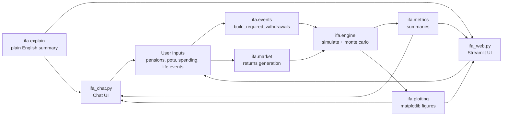
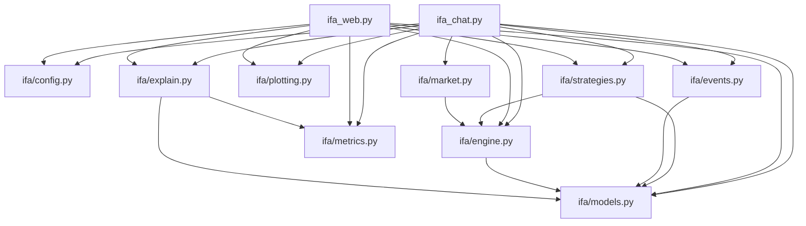

# Architecture (beginner friendly)

This project has three entrypoints:

- **Chat UI**: `ifa_chat.py` (conversational Streamlit interface)
- **Web app**: `ifa_web.py` (parameter-driven Streamlit dashboard)
- **CLI**: `pension_drawdown_simulator.py` (command line script)

All three reuse the same core `ifa/` Python package.

## Big picture (data flow)

## Modules (what each file does)

### Entrypoints
- `ifa_chat.py`
  - Provides a conversational chat interface via `st.chat_input()` /
    `st.chat_message()`
  - Parses natural-language questions with rule-based intent matching
  - Maintains a `ChatScenario` in `st.session_state` and updates it
    incrementally across turns
  - Selects relevant charts based on the user's question and renders them
    inline in the chat alongside plain-English explanations

- `ifa_web.py`
  - Collects inputs from the sidebar
  - Builds a **required withdrawals** schedule (baseline spending + life events - DB)
  - Runs deterministic and Monte Carlo simulations
  - Displays metrics and charts

- `pension_drawdown_simulator.py`
  - Similar idea, but from the command line

### Core package: `ifa/`
- `ifa/models.py`
  - Dataclasses for domain concepts:
    - `DbPension`, `LumpSumEvent`, `SpendingStepEvent`, etc.

- `ifa/events.py`
  - Turns your baseline spending + life events + DB income into:
    - `withdrawals_required[age]`
  - This is the key beginner-friendly idea:
    - “How much money must come from pots each year?”

- `ifa/market.py`
  - Generates return paths:
    - deterministic presets (Typical / Early bad / Early good / Constant)
    - Monte Carlo return matrices

- `ifa/engine.py`
  - Runs the simulation (pure logic: pots grow by returns, then we withdraw)
  - Important: it accepts `withdrawals_required` so DB and events are applied once

- `ifa/metrics.py`
  - Summarises results into easy-to-explain numbers:
    - ruin probability, median endings, etc.

- `ifa/plotting.py`
  - Converts results into matplotlib figures (and optionally saves PNGs)

- `ifa/explain.py`
  - Produces a short “why did this change?” narrative for novices

- `ifa/config.py`
  - Default values for starting pots/ages/return assumptions

- `ifa/strategies.py`
  - Withdrawal strategy functions (fixed real, guardrails, etc.)
  - Note: when using `withdrawals_required`, strategies are mostly used as a
    baseline spending reference rather than “the decider”.

## Dependency diagram (imports)

This shows the *direction of imports* (higher-level modules import lower-level modules).

## One concept to remember (for beginners)

The engine uses a **withdrawals_required** array:

- start with baseline spending
- add life events (lump sums and step-ups)
- subtract DB income
- clamp at 0

This makes the model easier to explain:
“this is how much you *need to take from investments* each year”.