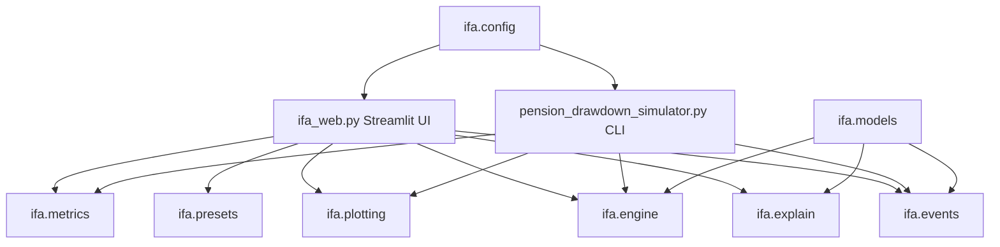
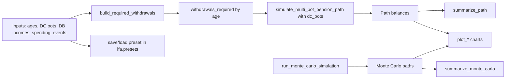

# Architecture

This project is organized so each part does one job.

## High-Level Structure

- `ifa_web.py`: Streamlit user interface.
- `pension_drawdown_simulator.py`: command-line runner that saves charts.
- `ifa/config.py`: default assumptions.
- `ifa/models.py`: typed data models (events, DB/DC pensions, results).
- `ifa/events.py`: converts spending + life events into yearly withdrawals.
- `ifa/engine.py`: core simulation logic.
- `ifa/market.py`: return sequence generation.
- `ifa/metrics.py`: summary statistics.
- `ifa/explain.py`: plain-English explanation text.
- `ifa/plotting.py`: matplotlib chart builders.
- `ifa/presets.py`: local save/load/delete helpers for Streamlit sidebar
    presets, including filename sanitization and saved-at metadata.

## Data Flow (Simulation)

The same simulation pipeline is used by both CLI and Streamlit.

1. Build ages and DB income by year.
2. Build required withdrawals from baseline spending and life events.
3. Build DC pot list with per-pot drawdown start ages.
4. Generate market returns (single path or many Monte Carlo paths).
5. Simulate pot balances over time.
6. Summarize results and render charts.
7. Optionally persist or restore sidebar parameters via local presets.
8. Preset selection auto-loads state; if unsaved changes exist, UI asks for
    confirmation before replacing current inputs.
9. On run, the UI snapshots the current sidebar state plus any selected saved
    comparison presets, then renders the current scenario and comparison
    panels from the same simulation pipeline.

## Why This Design Is Beginner-Friendly

- You can change UI or CLI behavior without touching core engine logic.
- DC pot drawdown ages are configured in one place and reused by both frontends.
- Life-event math is centralized in `ifa/events.py`.
- Chart functions read simulation outputs and do not own business rules.
- Explanations are generated by `ifa/explain.py`, separate from plotting.
- Preset persistence logic stays separate in `ifa/presets.py`, while
    interaction rules (auto-load and unsaved-change confirmation) live in
    `ifa_web.py`.
- `ifa_web.py` also normalizes saved preset state back into simulation inputs
    so current inputs and comparison presets share the same rendering path.
