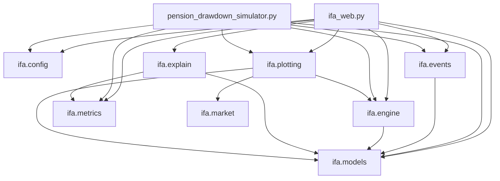
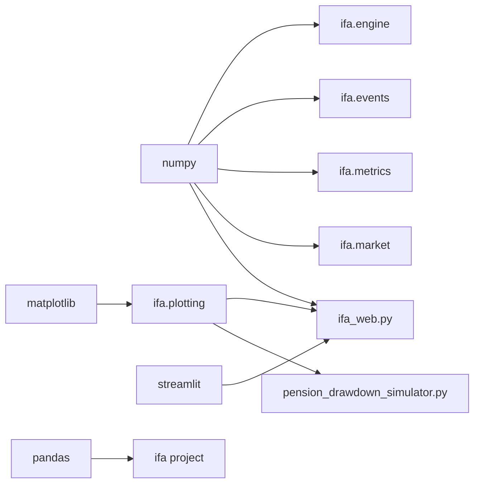

# Dependencies

This page shows how modules depend on each other.

## Runtime Dependencies

- `numpy`: numeric arrays and random returns.
- `matplotlib`: charts.
- `streamlit`: web app UI.
- `pandas`: currently installed as a project dependency.

## Internal Import Diagram

## Package-Level Dependency Diagram

## Notes

- Core simulation logic does not require Streamlit.
- Streamlit is only needed for `ifa_web.py`.
- CLI and Streamlit both reuse the same engine, events, and plotting modules.
- Both frontends now pass multi-DC-pot inputs into `ifa.engine` using per-pot
    drawdown start ages.
