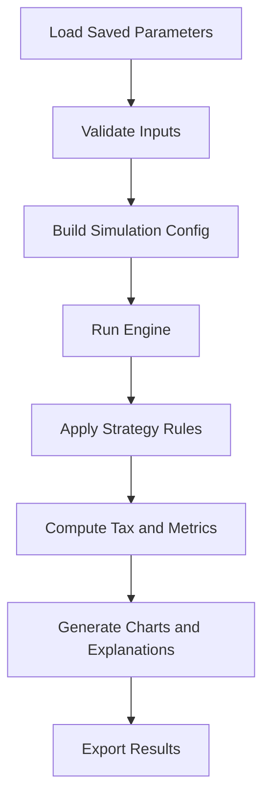

# IFA Simulation Flow Diagram

This diagram was generated using draw.io (via Mermaid input) and stored in Markdown for easy editing.

## Edit Notes

- Open this file in VS Code to update the Mermaid diagram.
- You can regenerate or refine the same diagram with draw.io tooling when needed.
