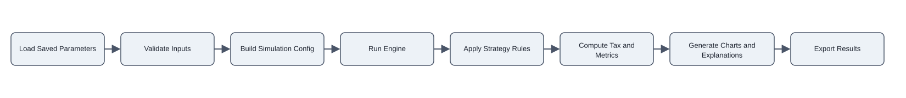

# IFA Simulation Flow Diagram (Raw draw.io XML)

This version embeds native draw.io XML (`mxGraphModel`) instead of Mermaid.



```xml
<mxGraphModel dx="1200" dy="800" grid="1" gridSize="10" guides="1" tooltips="1" connect="1" arrows="1" fold="1" page="1" pageScale="1" pageWidth="1169" pageHeight="827" math="0" shadow="0">
  <root>
    <mxCell id="0" />
    <mxCell id="1" parent="0" />

    <mxCell id="start" value="Load Saved Parameters" style="rounded=1;whiteSpace=wrap;html=1;" vertex="1" parent="1">
      <mxGeometry x="40" y="40" width="140" height="60" as="geometry" />
    </mxCell>
    <mxCell id="validate" value="Validate Inputs" style="rounded=1;whiteSpace=wrap;html=1;" vertex="1" parent="1">
      <mxGeometry x="220" y="40" width="140" height="60" as="geometry" />
    </mxCell>
    <mxCell id="config" value="Build Simulation Config" style="rounded=1;whiteSpace=wrap;html=1;" vertex="1" parent="1">
      <mxGeometry x="400" y="40" width="140" height="60" as="geometry" />
    </mxCell>
    <mxCell id="engine" value="Run Engine" style="rounded=1;whiteSpace=wrap;html=1;" vertex="1" parent="1">
      <mxGeometry x="580" y="40" width="140" height="60" as="geometry" />
    </mxCell>
    <mxCell id="strategy" value="Apply Strategy Rules" style="rounded=1;whiteSpace=wrap;html=1;" vertex="1" parent="1">
      <mxGeometry x="760" y="40" width="140" height="60" as="geometry" />
    </mxCell>
    <mxCell id="metrics" value="Compute Tax and Metrics" style="rounded=1;whiteSpace=wrap;html=1;" vertex="1" parent="1">
      <mxGeometry x="940" y="40" width="140" height="60" as="geometry" />
    </mxCell>
    <mxCell id="charts" value="Generate Charts and Explanations" style="rounded=1;whiteSpace=wrap;html=1;" vertex="1" parent="1">
      <mxGeometry x="1120" y="40" width="140" height="60" as="geometry" />
    </mxCell>
    <mxCell id="end" value="Export Results" style="rounded=1;whiteSpace=wrap;html=1;" vertex="1" parent="1">
      <mxGeometry x="1300" y="40" width="140" height="60" as="geometry" />
    </mxCell>

    <mxCell id="e1" edge="1" source="start" target="validate" parent="1" style="edgeStyle=orthogonalEdgeStyle;rounded=1;html=1;">
      <mxGeometry relative="1" as="geometry" />
    </mxCell>
    <mxCell id="e2" edge="1" source="validate" target="config" parent="1" style="edgeStyle=orthogonalEdgeStyle;rounded=1;html=1;">
      <mxGeometry relative="1" as="geometry" />
    </mxCell>
    <mxCell id="e3" edge="1" source="config" target="engine" parent="1" style="edgeStyle=orthogonalEdgeStyle;rounded=1;html=1;">
      <mxGeometry relative="1" as="geometry" />
    </mxCell>
    <mxCell id="e4" edge="1" source="engine" target="strategy" parent="1" style="edgeStyle=orthogonalEdgeStyle;rounded=1;html=1;">
      <mxGeometry relative="1" as="geometry" />
    </mxCell>
    <mxCell id="e5" edge="1" source="strategy" target="metrics" parent="1" style="edgeStyle=orthogonalEdgeStyle;rounded=1;html=1;">
      <mxGeometry relative="1" as="geometry" />
    </mxCell>
    <mxCell id="e6" edge="1" source="metrics" target="charts" parent="1" style="edgeStyle=orthogonalEdgeStyle;rounded=1;html=1;">
      <mxGeometry relative="1" as="geometry" />
    </mxCell>
    <mxCell id="e7" edge="1" source="charts" target="end" parent="1" style="edgeStyle=orthogonalEdgeStyle;rounded=1;html=1;">
      <mxGeometry relative="1" as="geometry" />
    </mxCell>
  </root>
</mxGraphModel>
```

## Usage

1. Copy the XML block.
2. In draw.io, choose File -> Import From -> Device (or paste into an XML-backed diagram).
